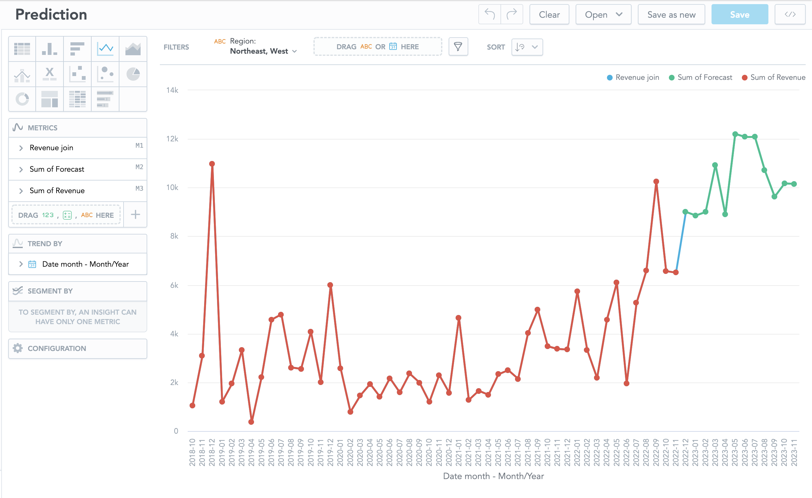

# Integration step-by-step tutorial

I prepared several tools for this. All tools/files are located in root directory of this project. In case of any issues do no hesitate to contact me.

## 1. Start services

All services used for this project are described in [docker-compose.yaml](docker-compose.yaml) file.
Run the following command to start all services.

```bash
docker compose up -d
```

After all services are up, you can check following links:
* MindsDB - [http://127.0.0.1:47334/](http://127.0.0.1:47334/)
* GoodData.CN - [http://localhost:3000/](http://localhost:3000/)

Credentials for GoodData.CN are:
* username: demo@example.com
* password: demo123
* token (for REST APIs or SDKs): YWRtaW46Ym9vdHN0cmFwOmFkbWluMTIz

## 2. Check MindsDB, GoodData.CN content (optional)

See [MindsDB Documentation](https://docs.mindsdb.com/) and [GoodData.CN Documentation](https://www.gooddata.com/developers/cloud-native/doc/) or [GoodData University](https://university.gooddata.com/page/gooddatacn) for further overview.

## 3. Connect to SQL gateway and import insights

The gooddata-fdw service exposes Postgres database that allows you to import insights from GoodData.CN as foreign tables using Foreign Data Wrapper technology and consume them by other data consumers.
I recommend using a database manager to connect to Postgres database. For the purpose of this demo [DBeaver](https://dbeaver.io/) was used.

The Postgres is accessible with the following settings:
* host: localhost
* port: 2543
* username: gooddata
* password: gooddata123
* database: gooddata

Executes the following command to create a connection with GoodData.CN instance.

```sql
CREATE SERVER multicorn_gooddata FOREIGN DATA WRAPPER multicorn
  OPTIONS (
    wrapper 'gooddata_fdw.GoodDataForeignDataWrapper',
    host 'http://gooddata-cn-ce:3000',
    token 'YWRtaW46Ym9vdHN0cmFwOmFkbWluMTIz',
    headers_host 'localhost'
  );
```
To import insights to the Postgres database as foreign tables, execute the following command:
```sql
CALL import_gooddata(workspace := 'demo', object_type := 'insights');
```
After these steps, you should be able to access insight revenue in time from the Postgres database.
Let us try to query it!
```sql
SELECT * FROM gooddata.demo.revenue_in_time;
```

# 4. MindsDB

First, we need to add the data source we want to work with. 
We will add Postgres database (SQL gateway) set in the previous step using the following command in running the MindsDB instance which is accessible from [http://127.0.0.1:47334/](http://127.0.0.1:47334/).

```sql
CREATE DATABASE fdw_gooddata
    WITH ENGINE = "postgres",
    PARAMETERS = {
        "user": "gooddata",
        "password": "gooddata123",
        "host": "gooddata-fdw", 
        "port": "5432",
        "database": "gooddata"
};
```
Let us check if the data source was added successfully.

```sql
SELECT * FROM fdw_gooddata.demo.revenue_in_time;
```

We will connect original data source connected to GoodData as well for importing predictions back to the original data source.

```sql
CREATE DATABASE ds_gooddata
    WITH ENGINE = "postgres",
    PARAMETERS = {
    "user": "demouser",
    "password": "demopass",
    "host": "gooddata-cn-ce",
    "port": "5432",
    "database": "demo"
};
```

Now we are ready to create a model for predicting revenue. We want to forecast revenue for each category in month-time granularity. The query below creates such a model.

```sql
CREATE PREDICTOR mindsdb.forecast_revenue
FROM fdw_gooddata
(SELECT date_month, region, revenue FROM demo.revenue_in_time)
PREDICT revenue

ORDER BY date_month
GROUP BY region

WINDOW 50
HORIZON 12;
```

The command triggers the training of the model. It is good to describe keywords WINDOW and HORIZON. WINDOW keyword specifies the number of rows to "look back" into when making a prediction, and the HORIZON keyword specifies the number of future predictions.
We can check the progress of the predictor in the following table. We are waiting for the predictor's status to be completed.

```sql
SELECT *
FROM mindsdb.predictors
WHERE name = 'forecast_revenue';
```

When training of the predictor is finished. Let us show the forecast of revenue for the South region.

```sql
SELECT m.date_month as date,
m.revenue as revenue
FROM mindsdb.forecast_revenue as m
JOIN fdw_gooddata.demo.revenue_in_time as t
WHERE t.date_month > LATEST AND t.region = 'South'
LIMIT 4;
```

As we can see, we can receive a forecast for the South region. Let us visualize it back in GoodData. For that purpose, we will create a table in origin data source "ds_gooddata" with predictions.

```sql
CREATE OR REPLACE TABLE ds_gooddata.demo.forecast (
    SELECT m.date_month as prediction_date_month, 
           m.revenue as prediction, 
           m.region as prediction_region, 
           t.revenue as revenue 
           FROM mindsdb.forecast_revenue as m 
    JOIN fdw_gooddata.demo.revenue_in_time as t
);
```

# 5. Prediction embedding

Our predictions are stored in the original data source. The original data source is accessible with the following settings:
* host: localhost
* port: 5432
* username: demouser
* password: demopass
* database: demo

Let us check that the forecast table was created back in original data source.

```sql
SELECT * FROM demo.demo.forecast f;
```

We can see that the structure of imported predictions is not ideal. 
Let us create a view that we can use back in visualization.

```sql
CREATE OR REPLACE 
VIEW demo.revenue_forecast AS
SELECT
    CAST(f.prediction_date_month  AS DATE) AS prediction_date,
    f.prediction_region AS prediction_region,
    CAST(f.revenue  AS FLOAT) AS revenue,
    CASE
        WHEN f.revenue IS NULL THEN f.prediction
        ELSE NULL
        END AS revenue_forecast
FROM
    demo.demo.forecast f
WHERE
    f.prediction_region IS NOT NULL;
```

# 6. Visualization of predictions in GoodData.CN

There is a Jupyter notebook [setup_data.ipynb](setup_data.ipynb) for setting up new LDM, creating insight with predictions and updating a dashboard.
Execute the code in the notebook, and you should see the following insight with predictions in the GoodData.CN. 
The actual revenue is distinguished from the predicted revenue by color.



